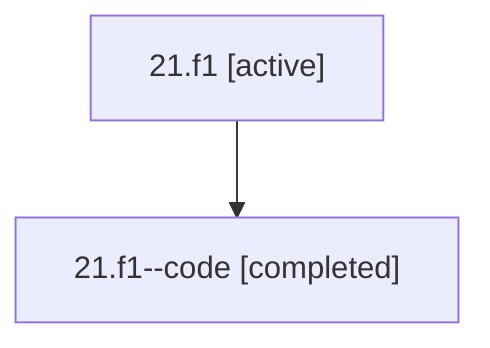

# Family: 21.f1

[Agent Hoods](../README.md) / [bbugyi200](../users/bbugyi200/README.md) / [athena](../users/bbugyi200/machines/athena/README.md) / [21](../users/bbugyi200/machines/athena/hoods/21/README.md) / 21.f1

Owner: `bbugyi200.athena` · Hood: `21` · Members: 2

## Lineage

The diagram is an optional enhancement; the ordered table below contains the same lineage in accessible text.

| Role | Agent | State | Model / provider | Timing | Commits | Prompt | Chat |
|---|---|---|---|---|---:|---|---|
| root | 21.f1 | active | opus / claude | 2026-07-08T16:55:40.938279+00:00 | [2](../agents/bbugyi200.athena.21.f1/README.md#commits) | [Prompt](../agents/bbugyi200.athena.21.f1/prompt.md) | [Chat](../agents/bbugyi200.athena.21.f1/chat.md) |
| code | 21.f1--code | completed | gpt-5.5 / codex | 2026-07-08T17:04:39.969793+00:00 | 0 | — | [Chat](../agents/bbugyi200.athena.21.f1--code/chat.md) |

## Commits

| Role | Repo | Commit | Subject | Committed (UTC) |
|---|---|---|---|---|
| root | bob-cli | [`45da09e`](https://github.com/bobs-org/bob-cli/commit/45da09edb7a0aacf8a3335b2cb33e9a6ab3c09c7) | chore: Add SDD prompt and plan for next\_status\_on\_pomodoro\_task\_link | 2026-07-08 17:04:38 |
| root | bob-cli | [`e7670d9`](https://github.com/bobs-org/bob-cli/commit/e7670d952224c0f8e93bc3a3bb3e2ef50a9a4302) | chore: Mark SDD plan done | 2026-07-08 18:02:41 |

## Neighbors

| Agent | Relation | State |
|---|---|---|
| [21](bbugyi200.athena.21.md) (family · 2) | ancestor | active 1, completed 1 |
| [21.f2](bbugyi200.athena.21.f2.md) (family · 2) | 21 hood | active 1, completed 1 |
