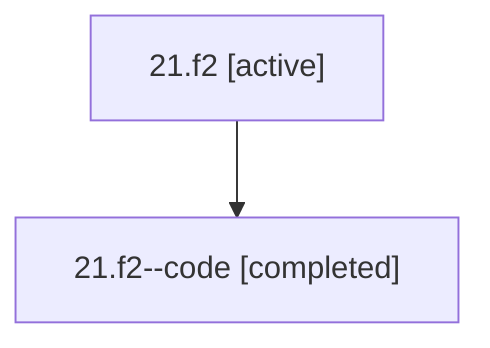

# Family: 21.f2

[Agent Hoods](../README.md) / [bbugyi200](../users/bbugyi200/README.md) / [athena](../users/bbugyi200/machines/athena/README.md) / [21](../users/bbugyi200/machines/athena/hoods/21/README.md) / 21.f2

Owner: `bbugyi200.athena` · Hood: `21` · Members: 2

## Lineage

The diagram is an optional enhancement; the ordered table below contains the same lineage in accessible text.

| Role | Agent | State | Model / provider | Timing | Commits | Prompt | Chat |
|---|---|---|---|---|---:|---|---|
| root | 21.f2 | active | opus / claude | 2026-07-08T17:02:52.535180+00:00 | [1](../agents/bbugyi200.athena.21.f2/README.md#commits) | [Prompt](../agents/bbugyi200.athena.21.f2/prompt.md) | [Chat](../agents/bbugyi200.athena.21.f2/chat.md) |
| code | 21.f2--code | completed | gpt-5.5 / codex | 2026-07-08T17:06:52.347705+00:00 | 0 | — | [Chat](../agents/bbugyi200.athena.21.f2--code/chat.md) |

## Commits

| Role | Repo | Commit | Subject | Committed (UTC) |
|---|---|---|---|---|
| root | bob-cli | [`dab8f20`](https://github.com/bobs-org/bob-cli/commit/dab8f20f95b931b0f05171e594f329a2af354586) | chore: Add SDD prompt and plan for fix\_next\_tasks\_query\_operator | 2026-07-08 17:06:51 |

## Neighbors

| Agent | Relation | State |
|---|---|---|
| [21](bbugyi200.athena.21.md) (family · 2) | ancestor | active 1, completed 1 |
| [21.f1](bbugyi200.athena.21.f1.md) (family · 2) | 21 hood | active 1, completed 1 |
