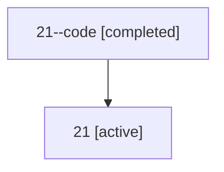

# Family: 21

[Agent Hoods](../README.md) / [bbugyi200](../users/bbugyi200/README.md) / [athena](../users/bbugyi200/machines/athena/README.md) / [21](../users/bbugyi200/machines/athena/hoods/21/README.md) / 21

Owner: `bbugyi200.athena` · Hood: `21` · Members: 2

## Lineage

The diagram is an optional enhancement; the ordered table below contains the same lineage in accessible text.

| Role | Agent | State | Model / provider | Timing | Commits | Prompt | Chat |
|---|---|---|---|---|---:|---|---|
| code | 21--code | completed | gpt-5.5 / codex | 2026-07-08T16:48:30.797106+00:00 | 0 | — | [Chat](../agents/bbugyi200.athena.21--code/chat.md) |
| root | 21 | active | opus / claude | 2026-07-08T16:32:22.801421+00:00 | [3](../agents/bbugyi200.athena.21/README.md#commits) | [Prompt](../agents/bbugyi200.athena.21/prompt.md) | [Chat](../agents/bbugyi200.athena.21/chat.md) |

## Commits

| Role | Commit | Subject | Committed (UTC) |
|---|---|---|---|
| root | [`248eee6`](https://github.com/bobs-org/bob-cli/commit/248eee6f08e24811607d3a4e16564741de3430b8) | chore: Add SDD prompt and plan for obsidian\_transclusion\_toggle\_keymap | 2026-06-04 02:02:19 |
| root | [`59eca4d`](https://github.com/bobs-org/bob-cli/commit/59eca4d5c863481971480471657c39b7ad954e52) | chore: Add SDD prompt and plan for replace\_blocked\_with\_next\_task\_status | 2026-07-08 16:48:29 |
| root | [`27ea107`](https://github.com/bobs-org/bob-cli/commit/27ea1079b9e7b2a8a29f7db8b2b768ab579acd31) | chore: update project task status examples | 2026-07-08 16:54:59 |

## Neighbors

| Agent | Relation | State |
|---|---|---|
| [21.f1](bbugyi200.athena.21.f1.md) (family · 2) | descendant | active 1, completed 1 |
| [21.f2](bbugyi200.athena.21.f2.md) (family · 2) | descendant | active 1, completed 1 |
