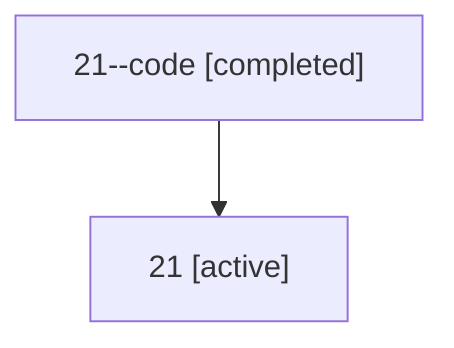

# Family: 21

Owner: `bbugyi200.athena` · Hood: `21` · Members: 2

## Lineage

The diagram is an optional enhancement; the ordered table below contains the same lineage in accessible text.

| Role | Agent | State | Model / provider | Timing | Commits | Prompt | Chat |
|---|---|---|---|---|---:|---|---|
| code | 21--code | completed | gpt-5.5 / codex | 2026-07-08T16:48:30.797106+00:00 | 0 | — | [Chat](../agents/bbugyi200.athena.21--code/chat.md) |
| root | 21 | active | opus / claude | 2026-07-08T16:32:22.801421+00:00 | 3 | [Prompt](../agents/bbugyi200.athena.21/prompt.md) | [Chat](../agents/bbugyi200.athena.21/chat.md) |
