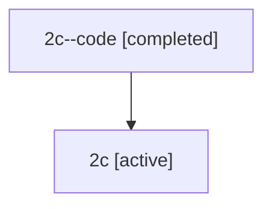

# Family: 2c

[Agent Hoods](../README.md) / [bbugyi200](../users/bbugyi200/README.md) / [athena](../users/bbugyi200/machines/athena/README.md) / [2c](../users/bbugyi200/machines/athena/hoods/2c/README.md) / 2c

Owner: `bbugyi200.athena` · Hood: `2c` · Members: 2

## Lineage

The diagram is an optional enhancement; the ordered table below contains the same lineage in accessible text.

| Role | Agent | State | Model / provider | Timing | Commits | Prompt | Chat |
|---|---|---|---|---|---:|---|---|
| code | 2c--code | completed | gpt-5.5 / codex | 2026-07-08T18:08:32.003819+00:00 | 0 | — | [Chat](../agents/bbugyi200.athena.2c--code/chat.md) |
| root | 2c | active | opus / claude | 2026-07-08T18:02:39.747877+00:00 | [1](../agents/bbugyi200.athena.2c/README.md#commits) | [Prompt](../agents/bbugyi200.athena.2c/prompt.md) | [Chat](../agents/bbugyi200.athena.2c/chat.md) |

## Commits

| Role | Repo | Commit | Subject | Committed (UTC) |
|---|---|---|---|---|
| root | bob-cli | [`577bbd6`](https://github.com/bobs-org/bob-cli/commit/577bbd6d6843b84163943d63e5eef60d10b3a1bd) | chore: Add SDD prompt and plan for pomodoro\_next\_status\_in\_progress | 2026-07-08 18:08:30 |
