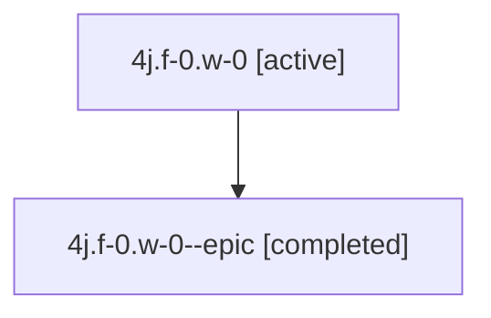

# Family: 4j.f-0.w-0

[Agent Hoods](../README.md) / [bbugyi200](../users/bbugyi200/README.md) / [athena](../users/bbugyi200/machines/athena/README.md) / [4j](../users/bbugyi200/machines/athena/hoods/4j/README.md) / 4j.f-0.w-0

Owner: `bbugyi200.athena` · Hood: `4j` · Members: 2

## Lineage

The diagram is an optional enhancement; the ordered table below contains the same lineage in accessible text.

| Role | Agent | State | Model / provider | Timing | Commits | Prompt | Chat |
|---|---|---|---|---|---:|---|---|
| root | 4j.f-0.w-0 | active | claude-fable-5 / claude | 2026-07-10T17:29:17.886126+00:00 | 0 | [Prompt](../agents/bbugyi200.athena.4j.f-0.w-0/prompt.md) | [Chat](../agents/bbugyi200.athena.4j.f-0.w-0/chat.md) |
| epic | 4j.f-0.w-0--epic | completed | gpt-5.6-sol / codex | 2026-07-10T17:42:34.006587+00:00 | 0 | — | [Chat](../agents/bbugyi200.athena.4j.f-0.w-0--epic/chat.md) |

## Neighbors

| Agent | Relation | State |
|---|---|---|
| [4j](bbugyi200.athena.4j.md) (family · 2) | ancestor | active 1, completed 1 |
