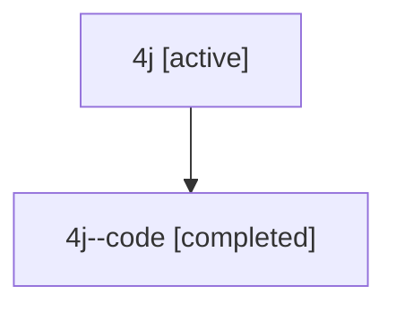

# Family: 4j

Owner: `bbugyi200.athena` · Hood: `4j` · Members: 2

## Lineage

The diagram is an optional enhancement; the ordered table below contains the same lineage in accessible text.

| Role | Agent | State | Model / provider | Timing | Commits | Prompt | Chat |
|---|---|---|---|---|---:|---|---|
| root | 4j | active | gpt-5.6-sol / codex | 2026-07-10T16:54:39.664066+00:00 | 1 | [Prompt](../agents/bbugyi200.athena.4j/prompt.md) | [Chat](../agents/bbugyi200.athena.4j/chat.md) |
| code | 4j--code | completed | gpt-5.6-sol / codex | 2026-07-10T16:57:43.578514+00:00 | 1 | — | [Chat](../agents/bbugyi200.athena.4j--code/chat.md) |
