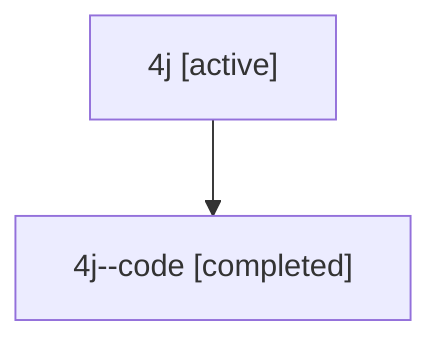

# Family: 4j

[Agent Hoods](../README.md) / [bbugyi200](../users/bbugyi200/README.md) / [athena](../users/bbugyi200/machines/athena/README.md) / [4j](../users/bbugyi200/machines/athena/hoods/4j/README.md) / 4j

Owner: `bbugyi200.athena` · Hood: `4j` · Members: 2

## Lineage

The diagram is an optional enhancement; the ordered table below contains the same lineage in accessible text.

| Role | Agent | State | Model / provider | Timing | Commits | Prompt | Chat |
|---|---|---|---|---|---:|---|---|
| root | 4j | active | gpt-5.6-sol / codex | 2026-07-10T16:54:39.664066+00:00 | [1](../agents/bbugyi200.athena.4j/README.md#commits) | [Prompt](../agents/bbugyi200.athena.4j/prompt.md) | [Chat](../agents/bbugyi200.athena.4j/chat.md) |
| code | 4j--code | completed | gpt-5.6-sol / codex | 2026-07-10T16:57:43.578514+00:00 | [1](../agents/bbugyi200.athena.4j--code/README.md#commits) | — | [Chat](../agents/bbugyi200.athena.4j--code/chat.md) |

## Commits

| Role | Commit | Subject | Committed (UTC) |
|---|---|---|---|
| code | [`f401add`](https://github.com/bobs-org/bob-cli/commit/f401add384dd0b0fa2f0e972b3c7aa1e4cfcf220) | feat(cli)!: rename dataview command to query | 2026-07-10 17:06:13 |
| root | [`f401add`](https://github.com/bobs-org/bob-cli/commit/f401add384dd0b0fa2f0e972b3c7aa1e4cfcf220) | feat(cli)!: rename dataview command to query | 2026-07-10 17:06:13 |

## Neighbors

| Agent | Relation | State |
|---|---|---|
| [4j.f-0.w-0](bbugyi200.athena.4j.f-0.w-0.md) (family · 2) | descendant | active 1, completed 1 |
