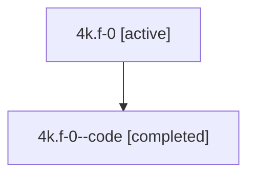

# Family: 4k.f-0

[Agent Hoods](../README.md) / [bbugyi200](../users/bbugyi200/README.md) / [athena](../users/bbugyi200/machines/athena/README.md) / [4k](../users/bbugyi200/machines/athena/hoods/4k/README.md) / 4k.f-0

Owner: `bbugyi200.athena` · Hood: `4k` · Members: 2

## Lineage

The diagram is an optional enhancement; the ordered table below contains the same lineage in accessible text.

| Role | Agent | State | Model / provider | Timing | Commits | Prompt | Chat |
|---|---|---|---|---|---:|---|---|
| root | 4k.f-0 | active | gpt-5.6-sol / codex | 2026-07-10T17:30:48.617292+00:00 | [1](../agents/bbugyi200.athena.4k.f-0/README.md#commits) | [Prompt](../agents/bbugyi200.athena.4k.f-0/prompt.md) | [Chat](../agents/bbugyi200.athena.4k.f-0/chat.md) |
| code | 4k.f-0--code | completed | gpt-5.6-sol / codex | 2026-07-10T17:34:22.744019+00:00 | [1](../agents/bbugyi200.athena.4k.f-0--code/README.md#commits) | — | [Chat](../agents/bbugyi200.athena.4k.f-0--code/chat.md) |

## Commits

| Role | Repo | Commit | Subject | Committed (UTC) |
|---|---|---|---|---|
| code | bob-cli | [`ddb1e54`](https://github.com/bobs-org/bob-cli/commit/ddb1e54013852313537e85f0b8b856b0969d7dde) | feat(projects): mark future-scheduled sub-projects | 2026-07-10 17:43:07 |
| root | bob-cli | [`ddb1e54`](https://github.com/bobs-org/bob-cli/commit/ddb1e54013852313537e85f0b8b856b0969d7dde) | feat(projects): mark future-scheduled sub-projects | 2026-07-10 17:43:07 |

## Neighbors

| Agent | Relation | State |
|---|---|---|
| [4k](bbugyi200.athena.4k.md) (family · 2) | ancestor | active 1, completed 1 |
