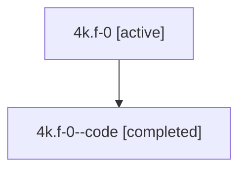

# Family: 4k.f-0

Owner: `bbugyi200.athena` · Hood: `4k` · Members: 2

## Lineage

The diagram is an optional enhancement; the ordered table below contains the same lineage in accessible text.

| Role | Agent | State | Model / provider | Timing | Commits | Prompt | Chat |
|---|---|---|---|---|---:|---|---|
| root | 4k.f-0 | active | gpt-5.6-sol / codex | 2026-07-10T17:30:48.617292+00:00 | 1 | [Prompt](../agents/bbugyi200.athena.4k.f-0/prompt.md) | [Chat](../agents/bbugyi200.athena.4k.f-0/chat.md) |
| code | 4k.f-0--code | completed | gpt-5.6-sol / codex | 2026-07-10T17:34:22.744019+00:00 | 1 | — | [Chat](../agents/bbugyi200.athena.4k.f-0--code/chat.md) |
