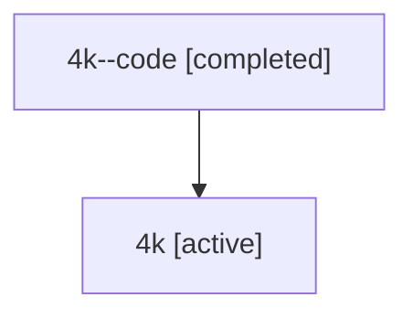

# Family: 4k

[Agent Hoods](../README.md) / [bbugyi200](../users/bbugyi200/README.md) / [athena](../users/bbugyi200/machines/athena/README.md) / [4k](../users/bbugyi200/machines/athena/hoods/4k/README.md) / 4k

Owner: `bbugyi200.athena` · Hood: `4k` · Members: 2

## Lineage

The diagram is an optional enhancement; the ordered table below contains the same lineage in accessible text.

| Role | Agent | State | Model / provider | Timing | Commits | Prompt | Chat |
|---|---|---|---|---|---:|---|---|
| code | 4k--code | completed | gpt-5.6-sol / codex | 2026-07-10T17:10:18.069027+00:00 | [1](../agents/bbugyi200.athena.4k--code/README.md#commits) | — | [Chat](../agents/bbugyi200.athena.4k--code/chat.md) |
| root | 4k | active | gpt-5.6-sol / codex | 2026-07-10T17:05:34.178269+00:00 | 0 | [Prompt](../agents/bbugyi200.athena.4k/prompt.md) | [Chat](../agents/bbugyi200.athena.4k/chat.md) |

## Commits

| Role | Repo | Commit | Subject | Committed |
|---|---|---|---|---|
| code | bob-cli | [`4c51d3b`](https://github.com/bobs-org/bob-cli/commit/4c51d3b20eced08b30e09ff392e29ee39b058bd6) | feat(projects): schedule project task visibility | 2026-07-10 13:28:50 EDT |

## Neighbors

| Agent | Relation | State |
|---|---|---|
| [4k.f-0](bbugyi200.athena.4k.f-0.md) (family · 2) | descendant | active 1, completed 1 |
