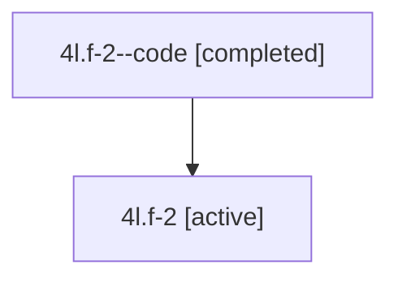

# Family: 4l.f-2

[Agent Hoods](../README.md) / [bbugyi200](../users/bbugyi200/README.md) / [athena](../users/bbugyi200/machines/athena/README.md) / [4l](../users/bbugyi200/machines/athena/hoods/4l/README.md) / 4l.f-2

Owner: `bbugyi200.athena` · Hood: `4l` · Members: 2

## Lineage

The diagram is an optional enhancement; the ordered table below contains the same lineage in accessible text.

| Role | Agent | State | Model / provider | Timing | Commits | Prompt | Chat |
|---|---|---|---|---|---:|---|---|
| code | 4l.f-2--code | completed | gpt-5.6-sol / codex | 2026-07-10T20:23:18.763386+00:00 | 0 | — | [Chat](../agents/bbugyi200.athena.4l.f-2--code/chat.md) |
| root | 4l.f-2 | active | gpt-5.6-sol / codex | 2026-07-10T20:18:17.266991+00:00 | 0 | [Prompt](../agents/bbugyi200.athena.4l.f-2/prompt.md) | [Chat](../agents/bbugyi200.athena.4l.f-2/chat.md) |

## Neighbors

| Agent | Relation | State |
|---|---|---|
| [4l](bbugyi200.athena.4l.md) (family · 2) | ancestor | active 1, completed 1 |
| [4l.f-2.f-0](bbugyi200.athena.4l.f-2.f-0.md) (family · 2) | descendant | active 1, completed 1 |
| [4l.f-2.f-0.w-0](../agents/bbugyi200.athena.4l.f-2.f-0.w-0/README.md) | descendant | active |
| [4l.f-0](bbugyi200.athena.4l.f-0.md) (family · 2) | 4l hood | active 1, completed 1 |
| [4l.f-0.f-0](bbugyi200.athena.4l.f-0.f-0.md) (family · 2) | 4l hood | active 2 |
| [4l.f-1](bbugyi200.athena.4l.f-1.md) (family · 2) | 4l hood | active 2 |
| [4l.f-1.f-0](../agents/bbugyi200.athena.4l.f-1.f-0/README.md) | 4l hood | active |
