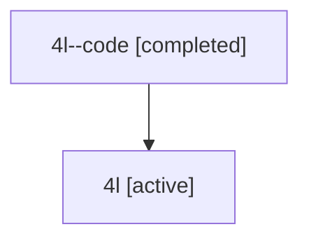

# Family: 4l

Owner: `bbugyi200.athena` · Hood: `4l` · Members: 2

## Lineage

The diagram is an optional enhancement; the ordered table below contains the same lineage in accessible text.

| Role | Agent | State | Model / provider | Timing | Commits | Prompt | Chat |
|---|---|---|---|---|---:|---|---|
| code | 4l--code | completed | gpt-5.6-sol / codex | 2026-07-10T17:31:51.926465+00:00 | 1 | — | [Chat](../agents/bbugyi200.athena.4l--code/chat.md) |
| root | 4l | active | gpt-5.6-sol / codex | 2026-07-10T13:21:26.466342 | 1 | [Prompt](../agents/bbugyi200.athena.4l/prompt.md) | [Chat](../agents/bbugyi200.athena.4l/chat.md) |
