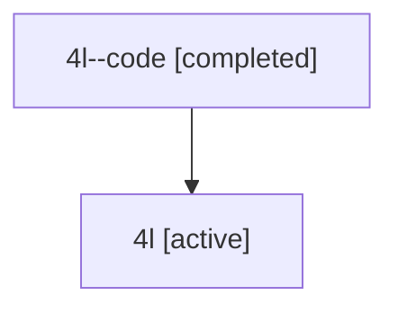

# Family: 4l

[Agent Hoods](../README.md) / [bbugyi200](../users/bbugyi200/README.md) / [athena](../users/bbugyi200/machines/athena/README.md) / [4l](../users/bbugyi200/machines/athena/hoods/4l/README.md) / 4l

Owner: `bbugyi200.athena` · Hood: `4l` · Members: 2

## Lineage

The diagram is an optional enhancement; the ordered table below contains the same lineage in accessible text.

| Role | Agent | State | Model / provider | Timing | Commits | Prompt | Chat |
|---|---|---|---|---|---:|---|---|
| code | 4l--code | completed | gpt-5.6-sol / codex | 2026-07-10T17:31:51.926465+00:00 | [1](../agents/bbugyi200.athena.4l--code/README.md#commits) | — | [Chat](../agents/bbugyi200.athena.4l--code/chat.md) |
| root | 4l | active | gpt-5.6-sol / codex | 2026-07-10T13:21:26.466342 | [1](../agents/bbugyi200.athena.4l/README.md#commits) | [Prompt](../agents/bbugyi200.athena.4l/prompt.md) | [Chat](../agents/bbugyi200.athena.4l/chat.md) |

## Commits

| Role | Repo | Commit | Subject | Committed (UTC) |
|---|---|---|---|---|
| code | bob-cli | [`15ec5ac`](https://github.com/bobs-org/bob-cli/commit/15ec5ac94d202575075309e5265fd663206af930) | feat(capture): link routed tasks to pomodoros | 2026-07-10 17:50:45 |
| root | bob-cli | [`15ec5ac`](https://github.com/bobs-org/bob-cli/commit/15ec5ac94d202575075309e5265fd663206af930) | feat(capture): link routed tasks to pomodoros | 2026-07-10 17:50:45 |

## Neighbors

| Agent | Relation | State |
|---|---|---|
| [4l.f-0](bbugyi200.athena.4l.f-0.md) (family · 2) | descendant | active 1, completed 1 |
| [4l.f-0.f-0](bbugyi200.athena.4l.f-0.f-0.md) (family · 2) | descendant | active 2 |
| [4l.f-1](bbugyi200.athena.4l.f-1.md) (family · 2) | descendant | active 2 |
| [4l.f-1.f-0](../agents/bbugyi200.athena.4l.f-1.f-0/README.md) | descendant | active |
| [4l.f-2](bbugyi200.athena.4l.f-2.md) (family · 2) | descendant | active 1, completed 1 |
| [4l.f-2.f-0](bbugyi200.athena.4l.f-2.f-0.md) (family · 2) | descendant | active 1, completed 1 |
| [4l.f-2.f-0.w-0](../agents/bbugyi200.athena.4l.f-2.f-0.w-0/README.md) | descendant | active |
