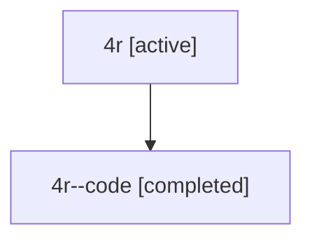

# Family: 4r

Owner: `bbugyi200.athena` · Hood: `4r` · Members: 2

## Lineage

The diagram is an optional enhancement; the ordered table below contains the same lineage in accessible text.

| Role | Agent | State | Model / provider | Timing | Commits | Prompt | Chat |
|---|---|---|---|---|---:|---|---|
| root | 4r | active | opus / claude | 2026-07-10T19:53:17.465064+00:00 | 1 | [Prompt](../agents/bbugyi200.athena.4r/prompt.md) | [Chat](../agents/bbugyi200.athena.4r/chat.md) |
| code | 4r--code | completed | gpt-5.6-sol / codex | 2026-07-10T20:02:54.820691+00:00 | 0 | — | [Chat](../agents/bbugyi200.athena.4r--code/chat.md) |
