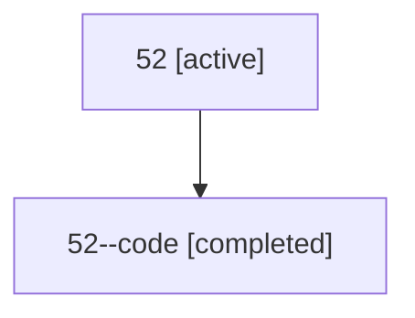

# Family: 52

[Agent Hoods](../README.md) / [bbugyi200](../users/bbugyi200/README.md) / [athena](../users/bbugyi200/machines/athena/README.md) / [52](../users/bbugyi200/machines/athena/hoods/52/README.md) / 52

Owner: `bbugyi200.athena` · Hood: `52` · Members: 2

## Lineage

The diagram is an optional enhancement; the ordered table below contains the same lineage in accessible text.

| Role | Agent | State | Model / provider | Timing | Commits | Prompt | Chat |
|---|---|---|---|---|---:|---|---|
| root | 52 | active | gpt-5.6-sol / codex | 2026-07-10T22:15:52.623969+00:00 | [1](../agents/bbugyi200.athena.52/README.md#commits) | [Prompt](../agents/bbugyi200.athena.52/prompt.md) | [Chat](../agents/bbugyi200.athena.52/chat.md) |
| code | 52--code | completed | gpt-5.6-sol / codex | 2026-07-10T22:18:52.518879+00:00 | [1](../agents/bbugyi200.athena.52--code/README.md#commits) | — | [Chat](../agents/bbugyi200.athena.52--code/chat.md) |

## Commits

| Role | Repo | Commit | Subject | Committed (UTC) |
|---|---|---|---|---|
| code | bob-cli | [`1ca1109`](https://github.com/bobs-org/bob-cli/commit/1ca11094811c5bcd04feeacec54e99b3503610d6) | feat: rehome completed Pomodoro task links | 2026-07-10 22:31:55 |
| root | bob-cli | [`1ca1109`](https://github.com/bobs-org/bob-cli/commit/1ca11094811c5bcd04feeacec54e99b3503610d6) | feat: rehome completed Pomodoro task links | 2026-07-10 22:31:55 |
