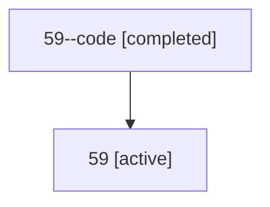

# Family: 59

[Agent Hoods](../README.md) / [bbugyi200](../users/bbugyi200/README.md) / [athena](../users/bbugyi200/machines/athena/README.md) / [59](../users/bbugyi200/machines/athena/hoods/59/README.md) / 59

Owner: `bbugyi200.athena` · Hood: `59` · Members: 2

## Lineage

The diagram is an optional enhancement; the ordered table below contains the same lineage in accessible text.

| Role | Agent | State | Model / provider | Timing | Commits | Prompt | Chat |
|---|---|---|---|---|---:|---|---|
| code | 59--code | completed | gpt-5.6-sol / codex | 2026-07-11T11:50:19.445914+00:00 | [1](../agents/bbugyi200.athena.59--code/README.md#commits) | — | [Chat](../agents/bbugyi200.athena.59--code/chat.md) |
| root | 59 | active | gpt-5.6-sol / codex | 2026-07-11T11:48:17.338183+00:00 | [1](../agents/bbugyi200.athena.59/README.md#commits) | [Prompt](../agents/bbugyi200.athena.59/prompt.md) | [Chat](../agents/bbugyi200.athena.59/chat.md) |

## Commits

| Role | Commit | Subject | Committed (UTC) |
|---|---|---|---|
| code | [`e7b1e3a`](https://github.com/bobs-org/bob-cli/commit/e7b1e3a1a3274c5f797e24fc526f0ca927818cc7) | fix(projects): preserve hidden project task when scheduled | 2026-07-11 11:54:57 |
| root | [`e7b1e3a`](https://github.com/bobs-org/bob-cli/commit/e7b1e3a1a3274c5f797e24fc526f0ca927818cc7) | fix(projects): preserve hidden project task when scheduled | 2026-07-11 11:54:57 |
