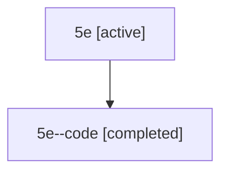

# Family: 5e

[Agent Hoods](../README.md) / [bbugyi200](../users/bbugyi200/README.md) / [athena](../users/bbugyi200/machines/athena/README.md) / [5e](../users/bbugyi200/machines/athena/hoods/5e/README.md) / 5e

Owner: `bbugyi200.athena` · Hood: `5e` · Members: 2

## Lineage

The diagram is an optional enhancement; the ordered table below contains the same lineage in accessible text.

| Role | Agent | State | Model / provider | Timing | Commits | Prompt | Chat |
|---|---|---|---|---|---:|---|---|
| root | 5e | active | gpt-5.6-sol / codex | 2026-07-11T12:42:13.427084+00:00 | [2](../agents/bbugyi200.athena.5e/README.md#commits) | [Prompt](../agents/bbugyi200.athena.5e/prompt.md) | [Chat](../agents/bbugyi200.athena.5e/chat.md) |
| code | 5e--code | completed | gpt-5.6-sol / codex | 2026-07-11T12:47:52.338543+00:00 | [1](../agents/bbugyi200.athena.5e--code/README.md#commits) | — | [Chat](../agents/bbugyi200.athena.5e--code/chat.md) |

## Commits

| Role | Commit | Subject | Committed (UTC) |
|---|---|---|---|
| root | [`a2a9d2d`](https://github.com/bobs-org/bob-cli/commit/a2a9d2d97ea4baf7f70671ff935bca2e4557a897) | chore: Add SDD prompt and plan for obsidian\_ctrl\_jk\_header\_navigation | 2026-06-11 15:11:46 |
| code | [`b6a9b4c`](https://github.com/bobs-org/bob-cli/commit/b6a9b4cdbd3d65530081c20ae9315f4332d55110) | docs: document project scheduling from lifecycle tasks | 2026-07-11 13:00:39 |
| root | [`b6a9b4c`](https://github.com/bobs-org/bob-cli/commit/b6a9b4cdbd3d65530081c20ae9315f4332d55110) | docs: document project scheduling from lifecycle tasks | 2026-07-11 13:00:39 |
