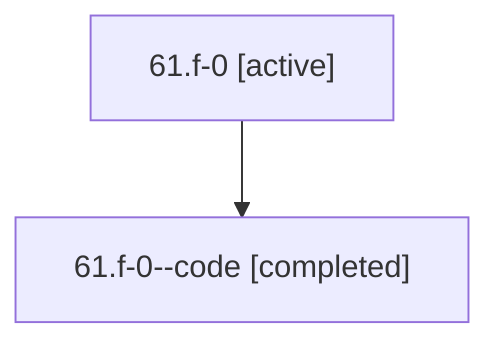

# Family: 61.f-0

[Agent Hoods](../README.md) / [bbugyi200](../users/bbugyi200/README.md) / [athena](../users/bbugyi200/machines/athena/README.md) / [61](../users/bbugyi200/machines/athena/hoods/61/README.md) / 61.f-0

Owner: `bbugyi200.athena` · Hood: `61` · Members: 2

## Lineage

The diagram is an optional enhancement; the ordered table below contains the same lineage in accessible text.

| Role | Agent | State | Model / provider | Timing | Commits | Prompt | Chat |
|---|---|---|---|---|---:|---|---|
| root | 61.f-0 | active | gpt-5.6-sol / codex | 2026-07-11T20:26:39.118250+00:00 | 0 | [Prompt](../agents/bbugyi200.athena.61.f-0/prompt.md) | [Chat](../agents/bbugyi200.athena.61.f-0/chat.md) |
| code | 61.f-0--code | completed | gpt-5.6-sol / codex | 2026-07-11T20:38:14.063313+00:00 | [1](../agents/bbugyi200.athena.61.f-0--code/README.md#commits) | — | [Chat](../agents/bbugyi200.athena.61.f-0--code/chat.md) |

## Commits

| Role | Repo | Commit | Subject | Committed |
|---|---|---|---|---|
| code | bob-cli | [`0e67766`](https://github.com/bobs-org/bob-cli/commit/0e677668a2082c3f099b8ce2bd2286f67f7dfea5) | feat: repair task dependency identities on archive moves | 2026-07-11 21:14:04 UTC |

## Neighbors

| Agent | Relation | State |
|---|---|---|
| [61](bbugyi200.athena.61.md) (family · 2) | ancestor | active 1, completed 1 |
| [61.f-1](bbugyi200.athena.61.f-1.md) (family · 2) | 61 hood | active 1, completed 1 |
| [61.f-2](bbugyi200.athena.61.f-2.md) (family · 2) | 61 hood | active 1, completed 1 |
