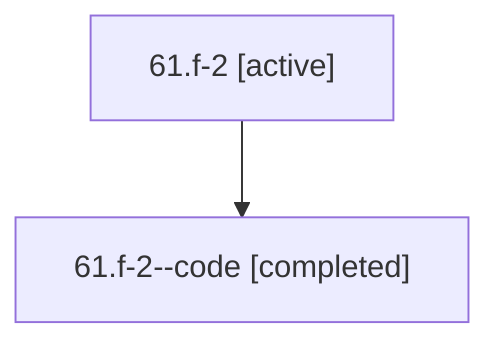

# Family: 61.f-2

Owner: `bbugyi200.athena` · Hood: `61` · Members: 2

## Lineage

The diagram is an optional enhancement; the ordered table below contains the same lineage in accessible text.

| Role | Agent | State | Model / provider | Timing | Commits | Prompt | Chat |
|---|---|---|---|---|---:|---|---|
| root | 61.f-2 | active | gpt-5.6-sol / codex | 2026-07-11T21:35:00.485112+00:00 | 0 | [Prompt](../agents/bbugyi200.athena.61.f-2/prompt.md) | [Chat](../agents/bbugyi200.athena.61.f-2/chat.md) |
| code | 61.f-2--code | completed | gpt-5.6-sol / codex | 2026-07-11T21:39:57.208280+00:00 | 0 | — | [Chat](../agents/bbugyi200.athena.61.f-2--code/chat.md) |
