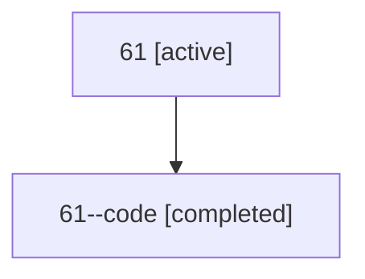

# Family: 61

[Agent Hoods](../README.md) / [bbugyi200](../users/bbugyi200/README.md) / [athena](../users/bbugyi200/machines/athena/README.md) / [61](../users/bbugyi200/machines/athena/hoods/61/README.md) / 61

Owner: `bbugyi200.athena` · Hood: `61` · Members: 2

## Lineage

The diagram is an optional enhancement; the ordered table below contains the same lineage in accessible text.

| Role | Agent | State | Model / provider | Timing | Commits | Prompt | Chat |
|---|---|---|---|---|---:|---|---|
| root | 61 | active | claude-fable-5 / claude | 2026-07-11T19:51:50.670985+00:00 | [1](../agents/bbugyi200.athena.61/README.md#commits) | [Prompt](../agents/bbugyi200.athena.61/prompt.md) | [Chat](../agents/bbugyi200.athena.61/chat.md) |
| code | 61--code | completed | gpt-5.6-sol / codex | 2026-07-11T20:09:00.845559+00:00 | [1](../agents/bbugyi200.athena.61--code/README.md#commits) | — | [Chat](../agents/bbugyi200.athena.61--code/chat.md) |

## Commits

| Role | Repo | Commit | Subject | Committed (UTC) |
|---|---|---|---|---|
| code | bob-cli | [`2677dea`](https://github.com/bobs-org/bob-cli/commit/2677dea6c80297ab5ef4f48b1097f1d4542e4ef8) | feat(mark-next): follow transcluded task dependencies | 2026-07-11 20:25:56 |
| root | bob-cli | [`2677dea`](https://github.com/bobs-org/bob-cli/commit/2677dea6c80297ab5ef4f48b1097f1d4542e4ef8) | feat(mark-next): follow transcluded task dependencies | 2026-07-11 20:25:56 |

## Neighbors

| Agent | Relation | State |
|---|---|---|
| [61.f-0](bbugyi200.athena.61.f-0.md) (family · 2) | descendant | active 1, completed 1 |
| [61.f-1](bbugyi200.athena.61.f-1.md) (family · 2) | descendant | active 1, completed 1 |
| [61.f-2](bbugyi200.athena.61.f-2.md) (family · 2) | descendant | active 1, completed 1 |
