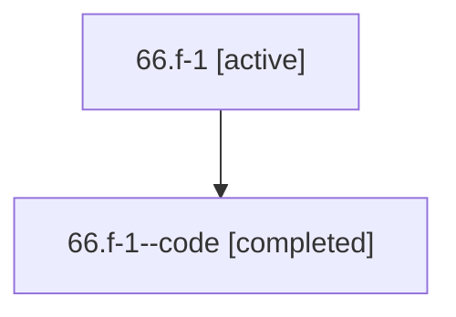

# Family: 66.f-1

[Agent Hoods](../README.md) / [bbugyi200](../users/bbugyi200/README.md) / [athena](../users/bbugyi200/machines/athena/README.md) / [66](../users/bbugyi200/machines/athena/hoods/66/README.md) / 66.f-1

Owner: `bbugyi200.athena` · Hood: `66` · Members: 2

## Lineage

The diagram is an optional enhancement; the ordered table below contains the same lineage in accessible text.

| Role | Agent | State | Model / provider | Timing | Commits | Prompt | Chat |
|---|---|---|---|---|---:|---|---|
| root | 66.f-1 | active | claude-fable-5 / claude | 2026-07-11T21:56:20.564425+00:00 | 0 | [Prompt](../agents/bbugyi200.athena.66.f-1/prompt.md) | [Chat](../agents/bbugyi200.athena.66.f-1/chat.md) |
| code | 66.f-1--code | completed | gpt-5.6-sol / codex | 2026-07-11T22:02:04.753326+00:00 | 0 | — | [Chat](../agents/bbugyi200.athena.66.f-1--code/chat.md) |

## Neighbors

| Agent | Relation | State |
|---|---|---|
| [66](../agents/bbugyi200.athena.66/README.md) | ancestor | completed |
