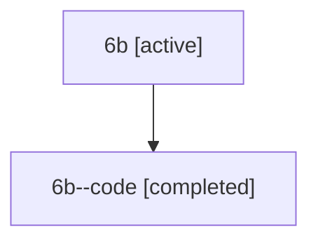

# Family: 6b

Owner: `bbugyi200.athena` · Hood: `6b` · Members: 2

## Lineage

The diagram is an optional enhancement; the ordered table below contains the same lineage in accessible text.

| Role | Agent | State | Model / provider | Timing | Commits | Prompt | Chat |
|---|---|---|---|---|---:|---|---|
| root | 6b | active | claude-fable-5 / claude | 2026-07-11T22:22:08.934377+00:00 | 1 | [Prompt](../agents/bbugyi200.athena.6b/prompt.md) | [Chat](../agents/bbugyi200.athena.6b/chat.md) |
| code | 6b--code | completed | gpt-5.6-sol / codex | 2026-07-11T22:53:08.393295+00:00 | 1 | — | [Chat](../agents/bbugyi200.athena.6b--code/chat.md) |
