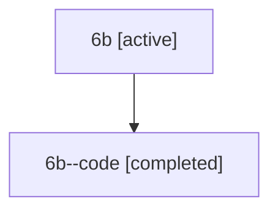

# Family: 6b

[Agent Hoods](../README.md) / [bbugyi200](../users/bbugyi200/README.md) / [athena](../users/bbugyi200/machines/athena/README.md) / [6b](../users/bbugyi200/machines/athena/hoods/6b/README.md) / 6b

Owner: `bbugyi200.athena` · Hood: `6b` · Members: 2

## Lineage

The diagram is an optional enhancement; the ordered table below contains the same lineage in accessible text.

| Role | Agent | State | Model / provider | Timing | Commits | Prompt | Chat |
|---|---|---|---|---|---:|---|---|
| root | 6b | active | claude-fable-5 / claude | 2026-07-11T22:22:08.934377+00:00 | 0 | [Prompt](../agents/bbugyi200.athena.6b/prompt.md) | [Chat](../agents/bbugyi200.athena.6b/chat.md) |
| code | 6b--code | completed | gpt-5.6-sol / codex | 2026-07-11T22:53:08.393295+00:00 | [1](../agents/bbugyi200.athena.6b--code/README.md#commits) | — | [Chat](../agents/bbugyi200.athena.6b--code/chat.md) |

## Commits

| Role | Repo | Commit | Subject | Committed |
|---|---|---|---|---|
| code | bob-cli | [`5db0e6a`](https://github.com/bobs-org/bob-cli/commit/5db0e6a0bfe4880d957d3c4b6a581a32e358b499) | fix: address review findings across native workflows | 2026-07-11 23:09:56 UTC |
