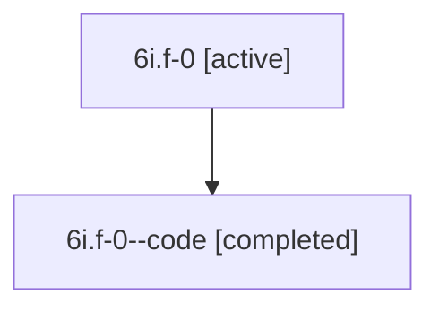

# Family: 6i.f-0

[Agent Hoods](../README.md) / [bbugyi200](../users/bbugyi200/README.md) / [athena](../users/bbugyi200/machines/athena/README.md) / [6i](../users/bbugyi200/machines/athena/hoods/6i/README.md) / 6i.f-0

Owner: `bbugyi200.athena` · Hood: `6i` · Members: 2

## Lineage

The diagram is an optional enhancement; the ordered table below contains the same lineage in accessible text.

| Role | Agent | State | Model / provider | Timing | Commits | Prompt | Chat |
|---|---|---|---|---|---:|---|---|
| root | 6i.f-0 | active | gpt-5.6-sol / codex | 2026-07-12T14:37:47.044105+00:00 | [1](../agents/bbugyi200.athena.6i.f-0/README.md#commits) | [Prompt](../agents/bbugyi200.athena.6i.f-0/prompt.md) | [Chat](../agents/bbugyi200.athena.6i.f-0/chat.md) |
| code | 6i.f-0--code | completed | gpt-5.6-sol / codex | 2026-07-12T14:43:53.411750+00:00 | [1](../agents/bbugyi200.athena.6i.f-0--code/README.md#commits) | — | [Chat](../agents/bbugyi200.athena.6i.f-0--code/chat.md) |

## Commits

| Role | Repo | Commit | Subject | Committed (UTC) |
|---|---|---|---|---|
| code | bob-cli | [`334f18b`](https://github.com/bobs-org/bob-cli/commit/334f18b8200bea940d056744e45ba46810445d90) | fix: preserve Pomodoro marker provenance | 2026-07-12 14:58:04 |
| root | bob-cli | [`334f18b`](https://github.com/bobs-org/bob-cli/commit/334f18b8200bea940d056744e45ba46810445d90) | fix: preserve Pomodoro marker provenance | 2026-07-12 14:58:04 |

## Neighbors

| Agent | Relation | State |
|---|---|---|
| [6i](bbugyi200.athena.6i.md) (family · 2) | ancestor | active 1, completed 1 |
