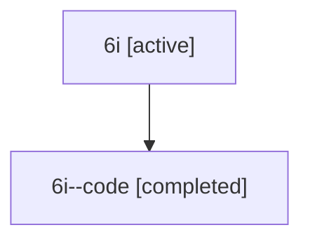

# Family: 6i

[Agent Hoods](../README.md) / [bbugyi200](../users/bbugyi200/README.md) / [athena](../users/bbugyi200/machines/athena/README.md) / [6i](../users/bbugyi200/machines/athena/hoods/6i/README.md) / 6i

Owner: `bbugyi200.athena` · Hood: `6i` · Members: 2

## Lineage

The diagram is an optional enhancement; the ordered table below contains the same lineage in accessible text.

| Role | Agent | State | Model / provider | Timing | Commits | Prompt | Chat |
|---|---|---|---|---|---:|---|---|
| root | 6i | active | claude-fable-5 / claude | 2026-07-12T12:21:54.674086+00:00 | 0 | [Prompt](../agents/bbugyi200.athena.6i/prompt.md) | [Chat](../agents/bbugyi200.athena.6i/chat.md) |
| code | 6i--code | completed | gpt-5.6-sol / codex | 2026-07-12T12:32:47.247800+00:00 | [1](../agents/bbugyi200.athena.6i--code/README.md#commits) | — | [Chat](../agents/bbugyi200.athena.6i--code/chat.md) |

## Commits

| Role | Repo | Commit | Subject | Committed |
|---|---|---|---|---|
| code | bob-cli | [`6e1fd4f`](https://github.com/bobs-org/bob-cli/commit/6e1fd4fe82a022242d35eccfa1ef568b1bab769a) | feat: normalize Pomodoro session markers | 2026-07-12 12:47:34 UTC |

## Neighbors

| Agent | Relation | State |
|---|---|---|
| [6i.f-0](bbugyi200.athena.6i.f-0.md) (family · 2) | descendant | active 1, completed 1 |
