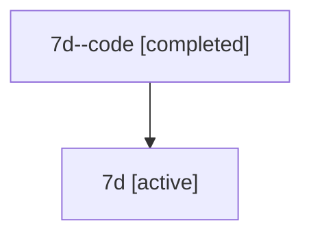

# Family: 7d

[Agent Hoods](../README.md) / [bbugyi200](../users/bbugyi200/README.md) / [athena](../users/bbugyi200/machines/athena/README.md) / [7d](../users/bbugyi200/machines/athena/hoods/7d/README.md) / 7d

Owner: `bbugyi200.athena` · Hood: `7d` · Members: 2

## Lineage

The diagram is an optional enhancement; the ordered table below contains the same lineage in accessible text.

| Role | Agent | State | Model / provider | Timing | Commits | Prompt | Chat |
|---|---|---|---|---|---:|---|---|
| code | 7d--code | completed | gpt-5.6-sol / codex | 2026-07-12T23:11:04.071542+00:00 | 0 | — | [Chat](../agents/bbugyi200.athena.7d--code/chat.md) |
| root | 7d | active | gpt-5.6-sol / codex | 2026-07-12T23:06:14.516512+00:00 | 0 | [Prompt](../agents/bbugyi200.athena.7d/prompt.md) | [Chat](../agents/bbugyi200.athena.7d/chat.md) |

## Commits

| Role | Repo | Commit | Subject | Committed |
|---|---|---|---|---|
| — | bob-cli | [`bf3e2b5`](https://github.com/bobs-org/bob-cli/commit/bf3e2b53d92fc3e7f309d85b25a95d050d32da4a) | chore: Add SDD prompt and plan for obsidian\_alt\_bracket\_bullet\_formatting | 2026-06-14 11:51:42 EDT |
