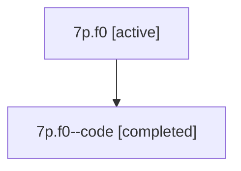

# Family: 7p.f0

[Agent Hoods](../README.md) / [bbugyi200](../users/bbugyi200/README.md) / [athena](../users/bbugyi200/machines/athena/README.md) / [7p](../users/bbugyi200/machines/athena/hoods/7p/README.md) / 7p.f0

Owner: `bbugyi200.athena` · Hood: `7p` · Members: 2

## Lineage

The diagram is an optional enhancement; the ordered table below contains the same lineage in accessible text.

| Role | Agent | State | Model / provider | Timing | Commits | Prompt | Chat |
|---|---|---|---|---|---:|---|---|
| root | 7p.f0 | active | gpt-5.6-sol / codex | 2026-07-13T12:36:57.115553+00:00 | [1](../agents/bbugyi200.athena.7p.f0/README.md#commits) | [Prompt](../agents/bbugyi200.athena.7p.f0/prompt.md) | [Chat](../agents/bbugyi200.athena.7p.f0/chat.md) |
| code | 7p.f0--code | completed | gpt-5.6-sol / codex | 2026-07-13T12:41:34.808119+00:00 | [1](../agents/bbugyi200.athena.7p.f0--code/README.md#commits) | — | [Chat](../agents/bbugyi200.athena.7p.f0--code/chat.md) |

## Commits

| Role | Repo | Commit | Subject | Committed (UTC) |
|---|---|---|---|---|
| code | bob-cli | [`0d3b3a6`](https://github.com/bobs-org/bob-cli/commit/0d3b3a654d0ea7ecda3f1a5368be66313a6fe688) | feat: prune duplicate open Pomodoro links | 2026-07-13 12:53:45 |
| root | bob-cli | [`0d3b3a6`](https://github.com/bobs-org/bob-cli/commit/0d3b3a654d0ea7ecda3f1a5368be66313a6fe688) | feat: prune duplicate open Pomodoro links | 2026-07-13 12:53:45 |

## Neighbors

| Agent | Relation | State |
|---|---|---|
| [7p](bbugyi200.athena.7p.md) (family · 2) | ancestor | active 1, completed 1 |
