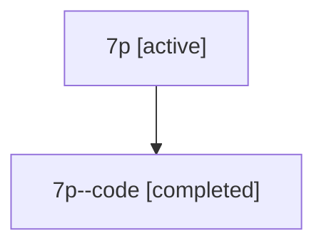

# Family: 7p

[Agent Hoods](../README.md) / [bbugyi200](../users/bbugyi200/README.md) / [athena](../users/bbugyi200/machines/athena/README.md) / [7p](../users/bbugyi200/machines/athena/hoods/7p/README.md) / 7p

Owner: `bbugyi200.athena` · Hood: `7p` · Members: 2

## Lineage

The diagram is an optional enhancement; the ordered table below contains the same lineage in accessible text.

| Role | Agent | State | Model / provider | Timing | Commits | Prompt | Chat |
|---|---|---|---|---|---:|---|---|
| root | 7p | active | gpt-5.6-sol / codex | 2026-07-13T12:18:22.614832+00:00 | 0 | [Prompt](../agents/bbugyi200.athena.7p/prompt.md) | [Chat](../agents/bbugyi200.athena.7p/chat.md) |
| code | 7p--code | completed | gpt-5.6-sol / codex | 2026-07-13T12:25:20.312933+00:00 | 0 | — | [Chat](../agents/bbugyi200.athena.7p--code/chat.md) |

## Neighbors

| Agent | Relation | State |
|---|---|---|
| [7p.f0](bbugyi200.athena.7p.f0.md) (family · 2) | descendant | active 1, completed 1 |
