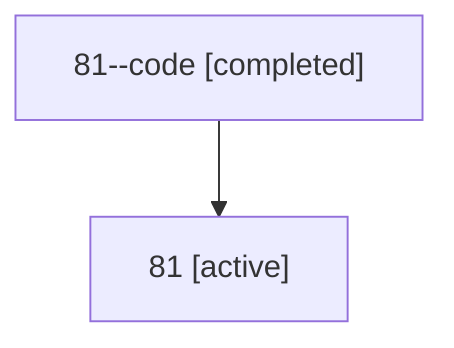

# Family: 81

Owner: `bbugyi200.athena` · Hood: `81` · Members: 2

## Lineage

The diagram is an optional enhancement; the ordered table below contains the same lineage in accessible text.

| Role | Agent | State | Model / provider | Timing | Commits | Prompt | Chat |
|---|---|---|---|---|---:|---|---|
| code | 81--code | completed | gpt-5.6-sol / codex | 2026-07-13T15:41:48.113791+00:00 | 0 | — | [Chat](../agents/bbugyi200.athena.81--code/chat.md) |
| root | 81 | active | gpt-5.6-sol / codex | 2026-07-13T15:38:05.652783+00:00 | 1 | [Prompt](../agents/bbugyi200.athena.81/prompt.md) | [Chat](../agents/bbugyi200.athena.81/chat.md) |
