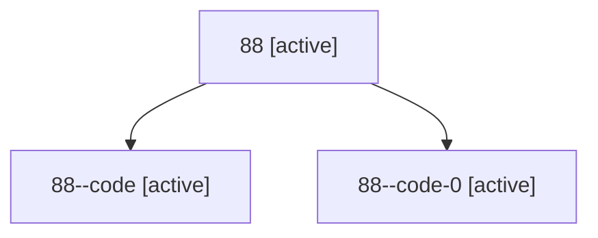

# Family: 88

Owner: `bbugyi200.athena` · Hood: `88` · Members: 3

## Lineage

The diagram is an optional enhancement; the ordered table below contains the same lineage in accessible text.

| Role | Agent | State | Model / provider | Timing | Commits | Prompt | Chat |
|---|---|---|---|---|---:|---|---|
| root | 88 | active | opus / claude | 2026-07-14T11:05:46.986195+00:00 | 1 | [Prompt](../agents/bbugyi200.athena.88/prompt.md) | [Chat](../agents/bbugyi200.athena.88/chat.md) |
| code | 88--code | active | gpt-5.6-sol / codex | 2026-07-14T11:21:40.091292+00:00 | 1 | — | [Chat](../agents/bbugyi200.athena.88--code/chat.md) |
| code-0 | 88--code-0 | active | gpt-5.6-sol / codex | 2026-07-14T11:40:11.181107+00:00 | 0 | — | — |
