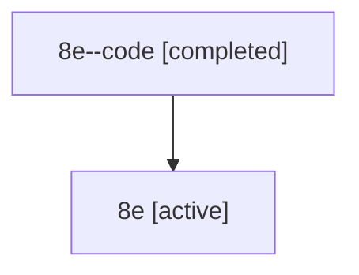

# Family: 8e

[Agent Hoods](../README.md) / [bbugyi200](../users/bbugyi200/README.md) / [athena](../users/bbugyi200/machines/athena/README.md) / [8e](../users/bbugyi200/machines/athena/hoods/8e/README.md) / 8e

Owner: `bbugyi200.athena` · Hood: `8e` · Members: 2

## Lineage

The diagram is an optional enhancement; the ordered table below contains the same lineage in accessible text.

| Role | Agent | State | Model / provider | Timing | Commits | Prompt | Chat |
|---|---|---|---|---|---:|---|---|
| code | 8e--code | completed | gpt-5.6-sol / codex | 2026-07-14T12:16:00.570928+00:00 | [1](../agents/bbugyi200.athena.8e--code/README.md#commits) | — | [Chat](../agents/bbugyi200.athena.8e--code/chat.md) |
| root | 8e | active | gpt-5.6-sol / codex | 2026-07-14T12:12:29.303018+00:00 | 0 | [Prompt](../agents/bbugyi200.athena.8e/prompt.md) | [Chat](../agents/bbugyi200.athena.8e/chat.md) |

## Commits

| Role | Repo | Commit | Subject | Committed |
|---|---|---|---|---|
| code | bob-cli | [`902db01`](https://github.com/bobs-org/bob-cli/commit/902db0183631e2c1fb49748b693a7d8a584fdda8) | fix: support aliases in recursive task transclusions | 2026-07-14 08:21:46 EDT |

## Neighbors

| Agent | Relation | State |
|---|---|---|
| [8e.f0](../agents/bbugyi200.athena.8e.f0/README.md) | descendant | active |
| [8e.f1](../agents/bbugyi200.athena.8e.f1/README.md) | descendant | active |
