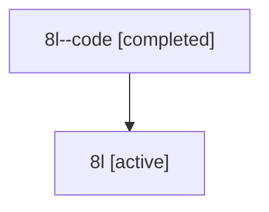

# Family: 8l

[Agent Hoods](../README.md) / [bbugyi200](../users/bbugyi200/README.md) / [athena](../users/bbugyi200/machines/athena/README.md) / [8l](../users/bbugyi200/machines/athena/hoods/8l/README.md) / 8l

Owner: `bbugyi200.athena` · Hood: `8l` · Members: 2

## Lineage

The diagram is an optional enhancement; the ordered table below contains the same lineage in accessible text.

| Role | Agent | State | Model / provider | Timing | Commits | Prompt | Chat |
|---|---|---|---|---|---:|---|---|
| code | 8l--code | completed | gpt-5.6-sol / codex | 2026-07-14T13:29:52.340043+00:00 | [1](../agents/bbugyi200.athena.8l--code/README.md#commits) | — | [Chat](../agents/bbugyi200.athena.8l--code/chat.md) |
| root | 8l | active | gpt-5.6-sol / codex | 2026-07-14T13:24:24.598728+00:00 | [1](../agents/bbugyi200.athena.8l/README.md#commits) | [Prompt](../agents/bbugyi200.athena.8l/prompt.md) | [Chat](../agents/bbugyi200.athena.8l/chat.md) |

## Commits

| Role | Commit | Subject | Committed (UTC) |
|---|---|---|---|
| code | [`161c4d0`](https://github.com/bobs-org/bob-cli/commit/161c4d0b339931dfccf131a50bc23dfec5fb2c03) | feat: propagate ranked dependency task statuses | 2026-07-14 13:44:48 |
| root | [`161c4d0`](https://github.com/bobs-org/bob-cli/commit/161c4d0b339931dfccf131a50bc23dfec5fb2c03) | feat: propagate ranked dependency task statuses | 2026-07-14 13:44:48 |
