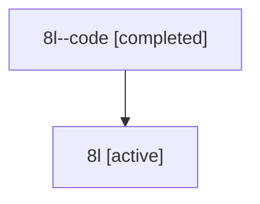

# Family: 8l

Owner: `bbugyi200.athena` · Hood: `8l` · Members: 2

## Lineage

The diagram is an optional enhancement; the ordered table below contains the same lineage in accessible text.

| Role | Agent | State | Model / provider | Timing | Commits | Prompt | Chat |
|---|---|---|---|---|---:|---|---|
| code | 8l--code | completed | gpt-5.6-sol / codex | 2026-07-14T13:29:52.340043+00:00 | 1 | — | [Chat](../agents/bbugyi200.athena.8l--code/chat.md) |
| root | 8l | active | gpt-5.6-sol / codex | 2026-07-14T13:24:24.598728+00:00 | 1 | [Prompt](../agents/bbugyi200.athena.8l/prompt.md) | [Chat](../agents/bbugyi200.athena.8l/chat.md) |
