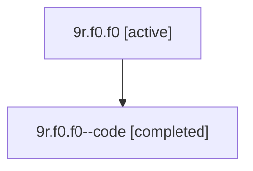

# Family: 9r.f0.f0

[Agent Hoods](../README.md) / [bbugyi200](../users/bbugyi200/README.md) / [athena](../users/bbugyi200/machines/athena/README.md) / [9r](../users/bbugyi200/machines/athena/hoods/9r/README.md) / 9r.f0.f0

Owner: `bbugyi200.athena` · Hood: `9r` · Members: 2

## Lineage

The diagram is an optional enhancement; the ordered table below contains the same lineage in accessible text.

| Role | Agent | State | Model / provider | Timing | Commits | Prompt | Chat |
|---|---|---|---|---|---:|---|---|
| root | 9r.f0.f0 | active | gpt-5.6-sol / codex | 2026-07-15T22:46:51.514358+00:00 | 0 | [Prompt](../agents/bbugyi200.athena.9r.f0.f0/prompt.md) | [Chat](../agents/bbugyi200.athena.9r.f0.f0/chat.md) |
| code | 9r.f0.f0--code | completed | gpt-5.6-sol / codex | 2026-07-15T22:57:34.849046+00:00 | [1](../agents/bbugyi200.athena.9r.f0.f0--code/README.md#commits) | — | [Chat](../agents/bbugyi200.athena.9r.f0.f0--code/chat.md) |

## Commits

| Role | Repo | Commit | Subject | Committed |
|---|---|---|---|---|
| code | bob-cli | [`e6b70be`](https://github.com/bobs-org/bob-cli/commit/e6b70be4c0c7ddbd06abbe5e567257f40e6d5bfd) | feat(capture)!: add counted clipboard history | 2026-07-15 19:21:22 EDT |

## Neighbors

| Agent | Relation | State |
|---|---|---|
| [9r.f0](bbugyi200.athena.9r.f0.md) (family · 2) | ancestor | active 1, completed 1 |
| [9r](bbugyi200.athena.9r.md) (family · 2) | ancestor | active 1, completed 1 |
