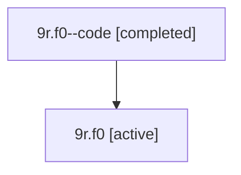

# Family: 9r.f0

Owner: `bbugyi200.athena` · Hood: `9r` · Members: 2

## Lineage

The diagram is an optional enhancement; the ordered table below contains the same lineage in accessible text.

| Role | Agent | State | Model / provider | Timing | Commits | Prompt | Chat |
|---|---|---|---|---|---:|---|---|
| code | 9r.f0--code | completed | gpt-5.6-sol / codex | 2026-07-15T22:29:05.250273+00:00 | 1 | — | [Chat](../agents/bbugyi200.athena.9r.f0--code/chat.md) |
| root | 9r.f0 | active | gpt-5.6-sol / codex | 2026-07-15T22:26:21.916602+00:00 | 1 | [Prompt](../agents/bbugyi200.athena.9r.f0/prompt.md) | [Chat](../agents/bbugyi200.athena.9r.f0/chat.md) |
