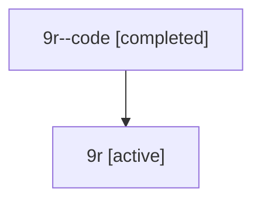

# Family: 9r

[Agent Hoods](../README.md) / [bbugyi200](../users/bbugyi200/README.md) / [athena](../users/bbugyi200/machines/athena/README.md) / [9r](../users/bbugyi200/machines/athena/hoods/9r/README.md) / 9r

Owner: `bbugyi200.athena` · Hood: `9r` · Members: 2

## Lineage

The diagram is an optional enhancement; the ordered table below contains the same lineage in accessible text.

| Role | Agent | State | Model / provider | Timing | Commits | Prompt | Chat |
|---|---|---|---|---|---:|---|---|
| code | 9r--code | completed | gpt-5.6-sol / codex | 2026-07-15T21:03:41.457353+00:00 | [1](../agents/bbugyi200.athena.9r--code/README.md#commits) | — | [Chat](../agents/bbugyi200.athena.9r--code/chat.md) |
| root | 9r | active | claude-fable-5 / claude | 2026-07-15T20:47:00.829850+00:00 | [1](../agents/bbugyi200.athena.9r/README.md#commits) | [Prompt](../agents/bbugyi200.athena.9r/prompt.md) | [Chat](../agents/bbugyi200.athena.9r/chat.md) |

## Commits

| Role | Commit | Subject | Committed (UTC) |
|---|---|---|---|
| code | [`7468820`](https://github.com/bobs-org/bob-cli/commit/7468820cd134daf36e179e393d3eea083bb2b2a9) | feat(capture): add clipboard sub-bullet capture | 2026-07-15 21:24:33 |
| root | [`7468820`](https://github.com/bobs-org/bob-cli/commit/7468820cd134daf36e179e393d3eea083bb2b2a9) | feat(capture): add clipboard sub-bullet capture | 2026-07-15 21:24:33 |

## Neighbors

| Agent | Relation | State |
|---|---|---|
| [9r.f0](bbugyi200.athena.9r.f0.md) (family · 2) | descendant | active 1, completed 1 |
| [9r.f0.f0](bbugyi200.athena.9r.f0.f0.md) (family · 2) | descendant | active 1, completed 1 |
