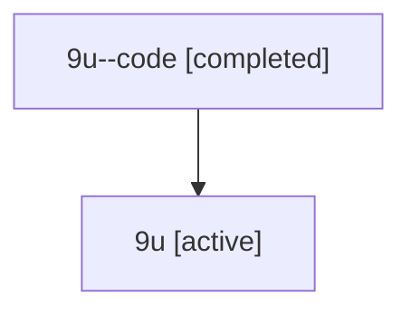

# Family: 9u

[Agent Hoods](../README.md) / [bbugyi200](../users/bbugyi200/README.md) / [athena](../users/bbugyi200/machines/athena/README.md) / [9u](../users/bbugyi200/machines/athena/hoods/9u/README.md) / 9u

Owner: `bbugyi200.athena` · Hood: `9u` · Members: 2

## Lineage

The diagram is an optional enhancement; the ordered table below contains the same lineage in accessible text.

| Role | Agent | State | Model / provider | Timing | Commits | Prompt | Chat |
|---|---|---|---|---|---:|---|---|
| code | 9u--code | completed | gpt-5.6-sol / codex | 2026-07-15T22:09:01.501052+00:00 | [1](../agents/bbugyi200.athena.9u--code/README.md#commits) | — | [Chat](../agents/bbugyi200.athena.9u--code/chat.md) |
| root | 9u | active | gpt-5.6-sol / codex | 2026-07-15T22:06:01.799901+00:00 | [1](../agents/bbugyi200.athena.9u/README.md#commits) | [Prompt](../agents/bbugyi200.athena.9u/prompt.md) | [Chat](../agents/bbugyi200.athena.9u/chat.md) |

## Commits

| Role | Commit | Subject | Committed (UTC) |
|---|---|---|---|
| code | [`9f5602d`](https://github.com/bobs-org/bob-cli/commit/9f5602d47708a541595299f47e9c8c171ef4f9e3) | fix: avoid unreachable macOS clipboard code | 2026-07-15 22:15:12 |
| root | [`9f5602d`](https://github.com/bobs-org/bob-cli/commit/9f5602d47708a541595299f47e9c8c171ef4f9e3) | fix: avoid unreachable macOS clipboard code | 2026-07-15 22:15:12 |
