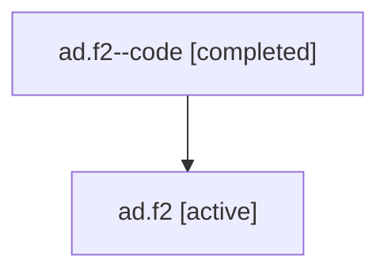

# Family: ad.f2

Owner: `bbugyi200.athena` · Hood: `ad` · Members: 2

## Lineage

The diagram is an optional enhancement; the ordered table below contains the same lineage in accessible text.

| Role | Agent | State | Model / provider | Timing | Commits | Prompt | Chat |
|---|---|---|---|---|---:|---|---|
| code | ad.f2--code | completed | gpt-5.6-sol / codex | 2026-07-16T15:25:48.253778+00:00 | 1 | — | [Chat](../agents/bbugyi200.athena.ad.f2--code/chat.md) |
| root | ad.f2 | active | gpt-5.6-sol / codex | 2026-07-16T15:17:50.249707+00:00 | 1 | [Prompt](../agents/bbugyi200.athena.ad.f2/prompt.md) | [Chat](../agents/bbugyi200.athena.ad.f2/chat.md) |
