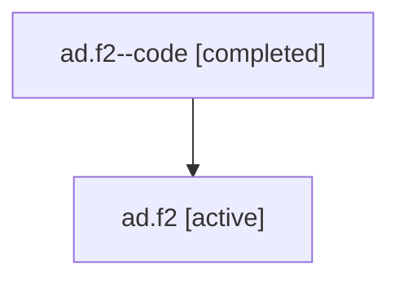

# Family: ad.f2

[Agent Hoods](../README.md) / [bbugyi200](../users/bbugyi200/README.md) / [athena](../users/bbugyi200/machines/athena/README.md) / [ad](../users/bbugyi200/machines/athena/hoods/ad/README.md) / ad.f2

Owner: `bbugyi200.athena` · Hood: `ad` · Members: 2

## Lineage

The diagram is an optional enhancement; the ordered table below contains the same lineage in accessible text.

| Role | Agent | State | Model / provider | Timing | Commits | Prompt | Chat |
|---|---|---|---|---|---:|---|---|
| code | ad.f2--code | completed | gpt-5.6-sol / codex | 2026-07-16T15:25:48.253778+00:00 | [1](../agents/bbugyi200.athena.ad.f2--code/README.md#commits) | — | [Chat](../agents/bbugyi200.athena.ad.f2--code/chat.md) |
| root | ad.f2 | active | gpt-5.6-sol / codex | 2026-07-16T15:17:50.249707+00:00 | 0 | [Prompt](../agents/bbugyi200.athena.ad.f2/prompt.md) | [Chat](../agents/bbugyi200.athena.ad.f2/chat.md) |

## Commits

| Role | Repo | Commit | Subject | Committed |
|---|---|---|---|---|
| code | bob-cli | [`bf21097`](https://github.com/bobs-org/bob-cli/commit/bf210971c13aa5060ecf145f7fbc7ecbbec40ccd) | feat(cli): recover task status dependency state | 2026-07-16 15:51:07 UTC |

## Neighbors

| Agent | Relation | State |
|---|---|---|
| [ad](bbugyi200.athena.ad.md) (family · 2) | ancestor | active 1, completed 1 |
| [ad.f0](../agents/bbugyi200.athena.ad.f0/README.md) | ad hood | active |
| [ad.f1](../agents/bbugyi200.athena.ad.f1/README.md) | ad hood | waiting |
