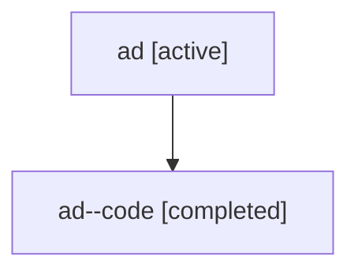

# Family: ad

Owner: `bbugyi200.athena` · Hood: `ad` · Members: 2

## Lineage

The diagram is an optional enhancement; the ordered table below contains the same lineage in accessible text.

| Role | Agent | State | Model / provider | Timing | Commits | Prompt | Chat |
|---|---|---|---|---|---:|---|---|
| root | ad | active | gpt-5.6-sol / codex | 2026-07-16T14:39:09.442711+00:00 | 1 | [Prompt](../agents/bbugyi200.athena.ad/prompt.md) | [Chat](../agents/bbugyi200.athena.ad/chat.md) |
| code | ad--code | completed | gpt-5.6-sol / codex | 2026-07-16T14:47:41.080869+00:00 | 1 | — | [Chat](../agents/bbugyi200.athena.ad--code/chat.md) |
