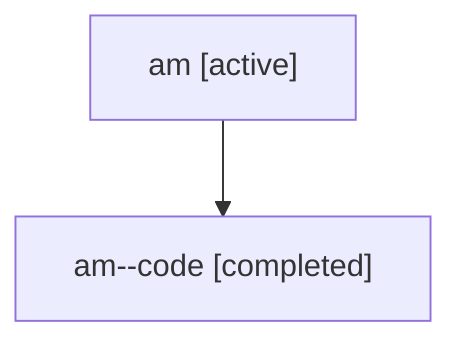

# Family: am

[Agent Hoods](../README.md) / [bbugyi200](../users/bbugyi200/README.md) / [athena](../users/bbugyi200/machines/athena/README.md) / [am](../users/bbugyi200/machines/athena/hoods/am/README.md) / am

Owner: `bbugyi200.athena` · Hood: `am` · Members: 2

## Lineage

The diagram is an optional enhancement; the ordered table below contains the same lineage in accessible text.

| Role | Agent | State | Model / provider | Timing | Commits | Prompt | Chat |
|---|---|---|---|---|---:|---|---|
| root | am | active | gpt-5.6-sol / codex | 2026-07-16T17:09:36.427199+00:00 | 0 | [Prompt](../agents/bbugyi200.athena.am/prompt.md) | [Chat](../agents/bbugyi200.athena.am/chat.md) |
| code | am--code | completed | gpt-5.6-sol / codex | 2026-07-16T17:13:26.156638+00:00 | [1](../agents/bbugyi200.athena.am--code/README.md#commits) | — | [Chat](../agents/bbugyi200.athena.am--code/chat.md) |

## Commits

| Role | Repo | Commit | Subject | Committed |
|---|---|---|---|---|
| code | bob-cli | [`d76885d`](https://github.com/bobs-org/bob-cli/commit/d76885d10527bca43cdc62bfeed1ff523cd66ce2) | fix(task-status-setter): remove canceled Pomodoro links | 2026-07-16 13:24:55 EDT |
