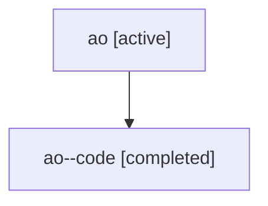

# Family: ao

Owner: `bbugyi200.athena` · Hood: `ao` · Members: 2

## Lineage

The diagram is an optional enhancement; the ordered table below contains the same lineage in accessible text.

| Role | Agent | State | Model / provider | Timing | Commits | Prompt | Chat |
|---|---|---|---|---|---:|---|---|
| root | ao | active | gpt-5.6-sol / codex | 2026-07-16T19:02:04.873241+00:00 | 1 | [Prompt](../agents/bbugyi200.athena.ao/prompt.md) | [Chat](../agents/bbugyi200.athena.ao/chat.md) |
| code | ao--code | completed | gpt-5.6-sol / codex | 2026-07-16T19:08:09.635626+00:00 | 1 | — | [Chat](../agents/bbugyi200.athena.ao--code/chat.md) |
