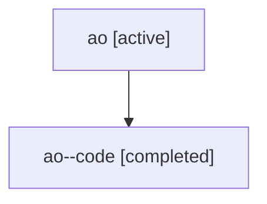

# Family: ao

[Agent Hoods](../README.md) / [bbugyi200](../users/bbugyi200/README.md) / [athena](../users/bbugyi200/machines/athena/README.md) / [ao](../users/bbugyi200/machines/athena/hoods/ao/README.md) / ao

Owner: `bbugyi200.athena` · Hood: `ao` · Members: 2

## Lineage

The diagram is an optional enhancement; the ordered table below contains the same lineage in accessible text.

| Role | Agent | State | Model / provider | Timing | Commits | Prompt | Chat |
|---|---|---|---|---|---:|---|---|
| root | ao | active | gpt-5.6-sol / codex | 2026-07-16T19:02:04.873241+00:00 | [1](../agents/bbugyi200.athena.ao/README.md#commits) | [Prompt](../agents/bbugyi200.athena.ao/prompt.md) | [Chat](../agents/bbugyi200.athena.ao/chat.md) |
| code | ao--code | completed | gpt-5.6-sol / codex | 2026-07-16T19:08:09.635626+00:00 | [1](../agents/bbugyi200.athena.ao--code/README.md#commits) | — | [Chat](../agents/bbugyi200.athena.ao--code/chat.md) |

## Commits

| Role | Commit | Subject | Committed (UTC) |
|---|---|---|---|
| code | [`8bc5a02`](https://github.com/bobs-org/bob-cli/commit/8bc5a02f5c46f2f2a4b1c8826dcba37fd621e472) | fix(task-status-setter): remove canceled reference subtrees | 2026-07-16 19:17:32 |
| root | [`8bc5a02`](https://github.com/bobs-org/bob-cli/commit/8bc5a02f5c46f2f2a4b1c8826dcba37fd621e472) | fix(task-status-setter): remove canceled reference subtrees | 2026-07-16 19:17:32 |
