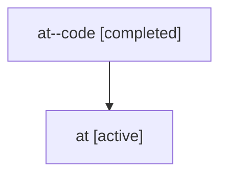

# Family: at

Owner: `bbugyi200.athena` · Hood: `at` · Members: 2

## Lineage

The diagram is an optional enhancement; the ordered table below contains the same lineage in accessible text.

| Role | Agent | State | Model / provider | Timing | Commits | Prompt | Chat |
|---|---|---|---|---|---:|---|---|
| code | at--code | completed | gpt-5.6-sol / codex | 2026-07-16T20:09:40.813421+00:00 | 1 | — | [Chat](../agents/bbugyi200.athena.at--code/chat.md) |
| root | at | active | gpt-5.6-sol / codex | 2026-07-16T20:05:23.648666+00:00 | 1 | [Prompt](../agents/bbugyi200.athena.at/prompt.md) | [Chat](../agents/bbugyi200.athena.at/chat.md) |
