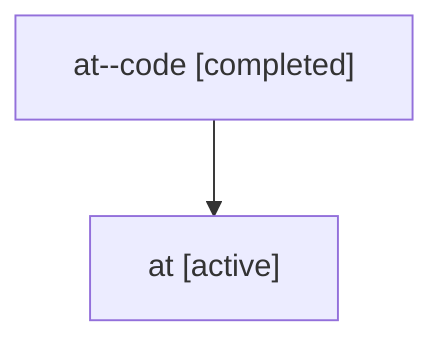

# Family: at

[Agent Hoods](../README.md) / [bbugyi200](../users/bbugyi200/README.md) / [athena](../users/bbugyi200/machines/athena/README.md) / [at](../users/bbugyi200/machines/athena/hoods/at/README.md) / at

Owner: `bbugyi200.athena` · Hood: `at` · Members: 2

## Lineage

The diagram is an optional enhancement; the ordered table below contains the same lineage in accessible text.

| Role | Agent | State | Model / provider | Timing | Commits | Prompt | Chat |
|---|---|---|---|---|---:|---|---|
| code | at--code | completed | gpt-5.6-sol / codex | 2026-07-16T20:09:40.813421+00:00 | [1](../agents/bbugyi200.athena.at--code/README.md#commits) | — | [Chat](../agents/bbugyi200.athena.at--code/chat.md) |
| root | at | active | gpt-5.6-sol / codex | 2026-07-16T20:05:23.648666+00:00 | 0 | [Prompt](../agents/bbugyi200.athena.at/prompt.md) | [Chat](../agents/bbugyi200.athena.at/chat.md) |

## Commits

| Role | Repo | Commit | Subject | Committed |
|---|---|---|---|---|
| code | bob-cli | [`cf931a3`](https://github.com/bobs-org/bob-cli/commit/cf931a3829015e5cfa004b32c715334e4982ebc9) | feat(cli): rename task status command to task-status-hooks | 2026-07-16 16:16:53 EDT |
