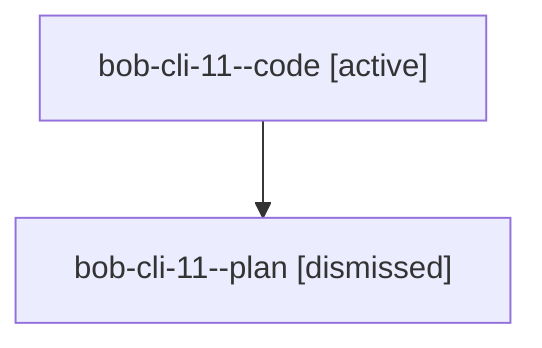

# Family: bob-cli-11

[Agent Hoods](../README.md) / [bbugyi200](../users/bbugyi200/README.md) / [athena](../users/bbugyi200/machines/athena/README.md) / [bob-cli-11](../users/bbugyi200/machines/athena/hoods/bob-cli-11/README.md) / bob-cli-11

Owner: `bbugyi200.athena` · Hood: `bob-cli-11` · Members: 2 · Bead: [bob-cli-11](https://github.com/bobs-org/bob-cli--beads/blob/main/pages/bob-cli-11/README.md)

## Lineage

The diagram is an optional enhancement; the ordered table below contains the same lineage in accessible text.

| Role | Agent | State | Model / provider | Timing | Commits | Prompt | Chat |
|---|---|---|---|---|---:|---|---|
| code | bob-cli-11--code | active | gpt-5.5 / codex | 2026-08-24T17:44:58.036688+00:00 | 0 | — | — |
| plan | bob-cli-11--plan | dismissed | — | 2026-08-24T13:34:03 | 0 | — | — |
