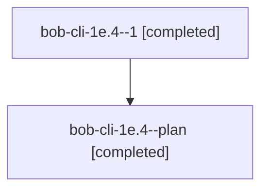

# Family: bob-cli-1e.4

[Agent Hoods](../README.md) / [bbugyi200](../users/bbugyi200/README.md) / [athena](../users/bbugyi200/machines/athena/README.md) / [bob-cli-1e](../users/bbugyi200/machines/athena/hoods/bob-cli-1e/README.md) / bob-cli-1e.4

Owner: `bbugyi200.athena` · Hood: `bob-cli-1e` · Members: 2 · Bead: [bob-cli-1e.4](https://github.com/bobs-org/bob-cli--beads/blob/main/pages/bob-cli-1e/bob-cli-1e.4.md)

## Lineage

The diagram is an optional enhancement; the ordered table below contains the same lineage in accessible text.

| Role | Agent | State | Model / provider | Timing | Commits | Prompt | Chat |
|---|---|---|---|---|---:|---|---|
| 1 | bob-cli-1e.4--1 | completed | sonnet / claude | 2026-08-27T12:36:55.892269+00:00 → 2026-08-27T12:38:40.307662+00:00 | 0 | — | [Chat](../agents/bbugyi200.athena.bob-cli-1e.4--1/chat.md) |
| plan | bob-cli-1e.4--plan | completed | sonnet / claude | 2026-08-27T12:35:14.271476+00:00 → 2026-08-27T12:38:40.307662+00:00 | 0 | [Prompt](../agents/bbugyi200.athena.bob-cli-1e.4--plan/prompt.md) | [Chat](../agents/bbugyi200.athena.bob-cli-1e.4--plan/chat.md) |

## Neighbors

| Agent | Relation | State |
|---|---|---|
| [bob-cli-1e.1](bbugyi200.athena.bob-cli-1e.1.md) (family · 2) | bob-cli-1e hood | completed 2 |
| [bob-cli-1e.2](../agents/bbugyi200.athena.bob-cli-1e.2/README.md) | bob-cli-1e hood | completed |
| [bob-cli-1e.3](../agents/bbugyi200.athena.bob-cli-1e.3/README.md) | bob-cli-1e hood | completed |
| [bob-cli-1e.5](../agents/bbugyi200.athena.bob-cli-1e.5/README.md) | bob-cli-1e hood | completed |
| [bob-cli-1e.land](bbugyi200.athena.bob-cli-1e.land.md) (family · 3) | bob-cli-1e hood | active 3 |
