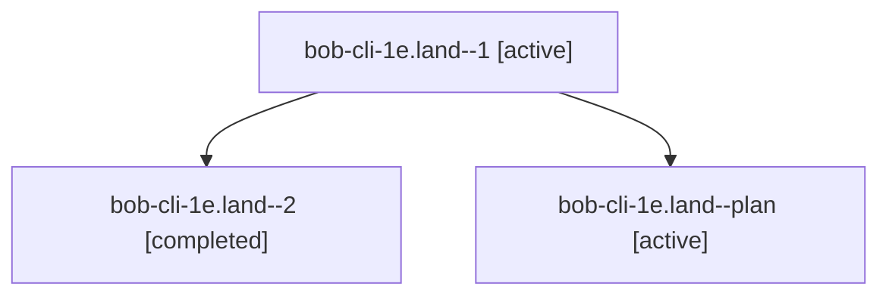

# Family: bob-cli-1e.land

[Agent Hoods](../README.md) / [bbugyi200](../users/bbugyi200/README.md) / [athena](../users/bbugyi200/machines/athena/README.md) / [bob-cli-1e](../users/bbugyi200/machines/athena/hoods/bob-cli-1e/README.md) / bob-cli-1e.land

Owner: `bbugyi200.athena` · Hood: `bob-cli-1e` · Members: 3 · Bead: [bob-cli-1e](https://github.com/bobs-org/bob-cli--beads/blob/main/pages/bob-cli-1e/README.md)

## Lineage

The diagram is an optional enhancement; the ordered table below contains the same lineage in accessible text.

| Role | Agent | State | Model / provider | Timing | Commits | Prompt | Chat |
|---|---|---|---|---|---:|---|---|
| 1 | bob-cli-1e.land--1 | active | opus / claude | 2026-08-27T12:54:15.038357+00:00 | 0 | — | [Chat](../agents/bbugyi200.athena.bob-cli-1e.land--1/chat.md) |
| 2 | bob-cli-1e.land--2 | completed | opus / claude | 2026-08-27T13:19:44.548800+00:00 → 2026-08-27T13:31:27.584644+00:00 | [1](../agents/bbugyi200.athena.bob-cli-1e.land--2/README.md#commits) | — | [Chat](../agents/bbugyi200.athena.bob-cli-1e.land--2/chat.md) |
| plan | bob-cli-1e.land--plan | active | opus / claude | 2026-08-27T12:43:40.676648+00:00 | 0 | [Prompt](../agents/bbugyi200.athena.bob-cli-1e.land--plan/prompt.md) | [Chat](../agents/bbugyi200.athena.bob-cli-1e.land--plan/chat.md) |

## Commits

| Role | Repo | Commit | Subject | Committed |
|---|---|---|---|---|
| 2 | bob-cli | [`6be39a7`](https://github.com/bobs-org/bob-cli/commit/6be39a78458b0d4bf39773c6df14411e148d603d) | docs: correct how desktop Obsidian stores sync exclusions | 2026-08-27 09:31:02 EDT |

## Neighbors

| Agent | Relation | State |
|---|---|---|
| [bob-cli-1e.1](bbugyi200.athena.bob-cli-1e.1.md) (family · 2) | bob-cli-1e hood | active 1, completed 1 |
| [bob-cli-1e.2](../agents/bbugyi200.athena.bob-cli-1e.2/README.md) | bob-cli-1e hood | active |
| [bob-cli-1e.3](../agents/bbugyi200.athena.bob-cli-1e.3/README.md) | bob-cli-1e hood | active |
| [bob-cli-1e.4](bbugyi200.athena.bob-cli-1e.4.md) (family · 2) | bob-cli-1e hood | active 1, completed 1 |
| [bob-cli-1e.5](../agents/bbugyi200.athena.bob-cli-1e.5/README.md) | bob-cli-1e hood | active |
