# Family: bob-cli-1n.1

[Agent Hoods](../README.md) / [bbugyi200](../users/bbugyi200/README.md) / [athena](../users/bbugyi200/machines/athena/README.md) / [bob-cli-1n](../users/bbugyi200/machines/athena/hoods/bob-cli-1n/README.md) / bob-cli-1n.1

Owner: `bbugyi200.athena` · Hood: `bob-cli-1n` · Members: 13 · Bead: [bob-cli-1n.1](https://github.com/bobs-org/bob-cli--beads/blob/main/pages/bob-cli-1n/bob-cli-1n.1.md)

## Lineage

```mermaid
flowchart TD
  n0["bob-cli-1n.1--1 [active]"]
  n1["bob-cli-1n.1--5 [active]"]
  n0 --> n1
  n2["bob-cli-1n.1--gate-2 [failed]"]
  n0 --> n2
  n3["bob-cli-1n.1--6 [completed]"]
  n0 --> n3
  n4["bob-cli-1n.1--gate-4 [failed]"]
  n0 --> n4
  n5["bob-cli-1n.1--4 [active]"]
  n0 --> n5
  n6["bob-cli-1n.1--3 [active]"]
  n0 --> n6
  n7["bob-cli-1n.1--plan [completed]"]
  n0 --> n7
  n8["bob-cli-1n.1--2 [active]"]
  n0 --> n8
  n9["bob-cli-1n.1--gate-3 [failed]"]
  n0 --> n9
  n10["bob-cli-1n.1--gate-0 [failed]"]
  n0 --> n10
  n11["bob-cli-1n.1--gate-1 [failed]"]
  n0 --> n11
  n12["bob-cli-1n.1--gate [failed]"]
  n0 --> n12
```

The diagram is an optional enhancement; the ordered table below contains the same lineage in accessible text.

| Role | Agent | State | Model / provider | Timing | Commits | Prompt | Chat |
|---|---|---|---|---|---:|---|---|
| 1 | bob-cli-1n.1--1 | active | gpt-5.5 / codex | 2026-08-27T17:05:54.958361+00:00 | 0 | — | [Chat](../agents/bbugyi200.athena.bob-cli-1n.1--1/chat.md) |
| 5 | bob-cli-1n.1--5 | active | gpt-5.5 / codex | 2026-08-27T17:30:53.343717+00:00 | 0 | — | [Chat](../agents/bbugyi200.athena.bob-cli-1n.1--5/chat.md) |
| gate-2 | bob-cli-1n.1--gate-2 | failed | gpt-5.5 / codex | 2026-08-27T17:26:54.616185+00:00 → 2026-08-27T17:26:56.320880+00:00 | 0 | — | [Chat](../agents/bbugyi200.athena.bob-cli-1n.1--gate-2/chat.md) |
| 6 | bob-cli-1n.1--6 | completed | gpt-5.5 / codex | 2026-08-27T17:44:03.032635+00:00 → 2026-08-27T18:05:16.108577+00:00 | 0 | — | [Chat](../agents/bbugyi200.athena.bob-cli-1n.1--6/chat.md) |
| gate-4 | bob-cli-1n.1--gate-4 | failed | gpt-5.5 / codex | 2026-08-27T17:43:56.515569+00:00 → 2026-08-27T17:43:58.088319+00:00 | 0 | — | [Chat](../agents/bbugyi200.athena.bob-cli-1n.1--gate-4/chat.md) |
| 4 | bob-cli-1n.1--4 | active | gpt-5.5 / codex | 2026-08-27T17:27:01.546270+00:00 | 0 | — | [Chat](../agents/bbugyi200.athena.bob-cli-1n.1--4/chat.md) |
| 3 | bob-cli-1n.1--3 | active | gpt-5.5 / codex | 2026-08-27T17:20:09.028912+00:00 | 0 | — | [Chat](../agents/bbugyi200.athena.bob-cli-1n.1--3/chat.md) |
| plan | bob-cli-1n.1--plan | completed | gpt-5.5 / codex | 2026-08-27T16:50:23.539738+00:00 → 2026-08-27T18:05:16.108577+00:00 | 0 | [Prompt](../agents/bbugyi200.athena.bob-cli-1n.1--plan/prompt.md) | [Chat](../agents/bbugyi200.athena.bob-cli-1n.1--plan/chat.md) |
| 2 | bob-cli-1n.1--2 | active | gpt-5.5 / codex | 2026-08-27T17:13:51.193526+00:00 | 0 | — | [Chat](../agents/bbugyi200.athena.bob-cli-1n.1--2/chat.md) |
| gate-3 | bob-cli-1n.1--gate-3 | failed | gpt-5.5 / codex | 2026-08-27T17:30:46.468319+00:00 → 2026-08-27T17:30:48.115892+00:00 | 0 | — | [Chat](../agents/bbugyi200.athena.bob-cli-1n.1--gate-3/chat.md) |
| gate-0 | bob-cli-1n.1--gate-0 | failed | gpt-5.5 / codex | 2026-08-27T17:13:41.576263+00:00 → 2026-08-27T17:13:44.471304+00:00 | 0 | — | [Chat](../agents/bbugyi200.athena.bob-cli-1n.1--gate-0/chat.md) |
| gate-1 | bob-cli-1n.1--gate-1 | failed | gpt-5.5 / codex | 2026-08-27T17:20:00.424260+00:00 → 2026-08-27T17:20:02.850605+00:00 | 0 | — | [Chat](../agents/bbugyi200.athena.bob-cli-1n.1--gate-1/chat.md) |
| gate | bob-cli-1n.1--gate | failed | gpt-5.5 / codex | 2026-08-27T17:05:44.027460+00:00 → 2026-08-27T17:05:47.106058+00:00 | 0 | — | [Chat](../agents/bbugyi200.athena.bob-cli-1n.1--gate/chat.md) |

## Neighbors

| Agent | Relation | State |
|---|---|---|
| [bob-cli-1n.2](../agents/bbugyi200.athena.bob-cli-1n.2/README.md) | bob-cli-1n hood | completed |
| [bob-cli-1n.3](../agents/bbugyi200.athena.bob-cli-1n.3/README.md) | bob-cli-1n hood | completed |
| [bob-cli-1n.4](../agents/bbugyi200.athena.bob-cli-1n.4/README.md) | bob-cli-1n hood | completed |
| [bob-cli-1n.5](../agents/bbugyi200.athena.bob-cli-1n.5/README.md) | bob-cli-1n hood | active |
| [bob-cli-1n.6](../agents/bbugyi200.athena.bob-cli-1n.6/README.md) | bob-cli-1n hood | waiting |
| [bob-cli-1n.land](../agents/bbugyi200.athena.bob-cli-1n.land/README.md) | bob-cli-1n hood | waiting |
